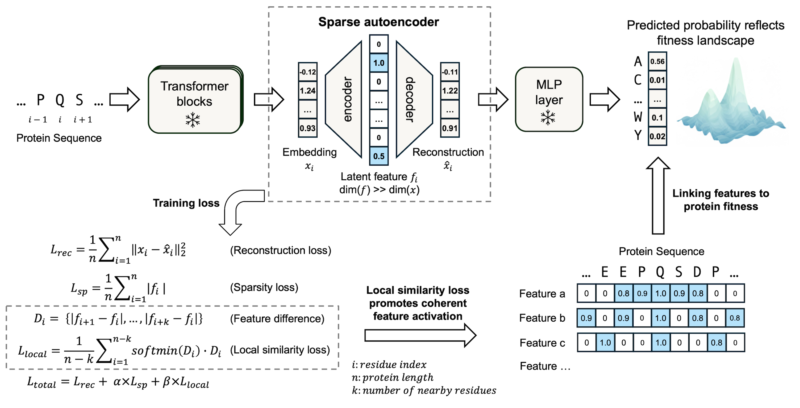

## MotifAE: Unsupervised Discovery of Functional Motifs from Protein Language Model

MotifAE is a sparse autoencoder with local similarity loss, designed for the unsupervised discovery of functional protein motifs from Protein Language Model. It incorporates a **local similarity loss** to encourage the learned latent features to capture meaningful, coherent local patterns (motifs) within the protein sequences.


-----

## Prerequisites
For MotifAE training and running, please set up the environment first:

```bash
conda create -n motifae python=3.12
conda activate motifae
pip install fair-esm pandas numpy
pip install torch==2.4.1 torchvision==0.19.1 torchaudio==2.4.1 --index-url https://download.pytorch.org/whl/cu121
```
Other environments with the necessary dependencies should also work as long as PyTorch and ESM are properly installed.

## Use Pre-trained Models

The weights for the trained MotifAE model can be downloaded from [Zenodo]().

### Compare MotifAE Features with Known Motifs
Please refer to 
[`notebook/ELM_motif.ipynb`](./notebook/ELM_motif.ipynb) for instructions on how to:
- Load a trained **MotifAE** model,  
- Extract **latent features** from protein sequences,   
- Compare these latent features with known annotations (e.g., ELM motifs),


### MotifAE-G for Feature Alignment with Experimental Data and Protein Design
To use MotifAE-G for aligning latent features with experimental data — for example, stability mutation scans of 412 proteins — follow the steps below:

1. The information for these 412 proteins is provided in [`data/412pro_info.csv`](./data/412pro_info.csv). Please download the corresponding mutation effect data from [Zenodo](https://zenodo.org/).
2. Process these data using code in [`gate/1_stability_prepare.ipynb`](./gate/1_stability_prepare.ipynb)
3. Train MotifAE-G to align latent features with experimental measurements: [`gate/2_gate_model.ipynb`](./gate/2_gate_model.ipynb)  
4. Designing proteins with enhanced stability by steering stability-associated latent features: [`gate/3_protein_design.ipynb`](./gate/3_protein_design.ipynb)  

-----

## Training the Model. 

To train the MotifAE from scratch, follow the steps below.

### Step 1: Download Representative Protein Data

Download the dataset of **2.3 million representative proteins** from [Zenodo](https://zenodo.org/).  
This dataset was derived through [structure-based clustering of the AlphaFold structure database](https://afdb-cluster.steineggerlab.workers.dev/).


### Step 2: Generate ESM-2 Embeddings

Use ESM2-650M to generate last layer embeddings for these representative proteins.

1. Edit [`model/config.py`](./model/config.py) to specify:
   - The path to your downloaded protein `.csv` files.  
   - The output directory where embeddings will be saved.

2. Execute the following command to generate embeddings:

   ```bash
   python model/get_esm2_embedding.py
   ```

### Step 3: Train the MotifAE Model

Once the embeddings are ready, you can train the MotifAE model.

1. Edit [`model/config.py`](./model/config.py) to define the path for saving model checkpoints and log files

1. Run Training Script
   ```bash
   python model/train_esm_sae.py
   ```

-----
## Citation
